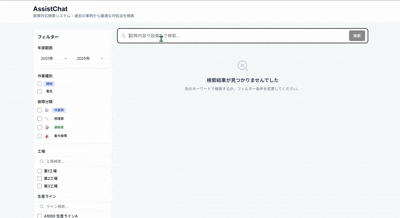
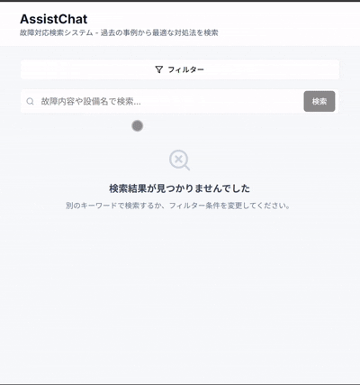

# AssistChat

[](https://github.com/RyugoHori/AssistChat-Portfolio/actions/workflows/ci.yml)

**工場設備のトラブルシューティングを支援するRAGベース検索システム**

過去の保全記録（故障対応ログ）をハイブリッド検索し、類似事例を高精度で提示。
現場でのダウンタイム短縮と、若手保全マンへの技能伝承を目的に開発しました。

---

## デモ

| PC版 | モバイル版 |
|------|-----------|
|  |  |

---

## 特徴

- **ハイブリッド検索**: FAISS（ベクトル検索）+ BM25（キーワード検索）
- **Re-ranking**: Cross-Encoderによる再順位付けで精度向上
- **完全ローカル実行**: 機密データを外部に送信しない設計

---

## 技術スタック

| カテゴリ | 技術 |
|----------|------|
| Frontend | Next.js 14, TypeScript, Tailwind CSS, shadcn/ui |
| Backend | FastAPI, Python 3.11 |
| RAG | Sentence-Transformers, FAISS, BM25, Cross-Encoder |
| 日本語処理 | MeCab + unidic-lite |
| インフラ | Docker Compose |
| CI/CD | GitHub Actions |

---

## クイックスタート

```bash
# 1. クローン
git clone https://github.com/RyugoHori/AssistChat-Portfolio.git
cd AssistChat-Portfolio

# 2. 起動
docker-compose up --build

# 3. アクセス
# Frontend: http://localhost:3000
# API Docs: http://localhost:8001/docs
```

### インデックス構築（初回のみ）

```bash
docker-compose exec rag-api bash

python /app/tools/index-builder/preprocess.py \
  --input /app/data/demo/demo_logs.csv \
  --output /app/data/processed

python /app/tools/index-builder/build_index.py \
  --input /app/data/processed/chunks.jsonl \
  --output /app/data/indices

exit
```

---

## ドキュメント

| ドキュメント | 内容 |
|-------------|------|
| [プロジェクトについて](docs/ABOUT_PROJECT.md) | 開発背景、技術選定の理由、学び |
| [アーキテクチャ](docs/ARCHITECTURE.md) | システム構成、検索フロー、API仕様 |

---

## プロジェクト構造

```
AssistChat/
├── apps/assist-chat/     # Next.js Frontend
├── packages/rag-core/    # 共通RAGライブラリ
├── services/rag-api/     # FastAPI Backend
├── tools/index-builder/  # インデックス構築ツール
└── data/                 # デモデータ、インデックス
```

---

## 作者

**Ryugo Hori** - [@RyugoHori](https://github.com/RyugoHori)

21歳、製造業の設備保全担当。本務の傍らICT班を兼務し、現場改善とIT活用に取り組んでいます。
