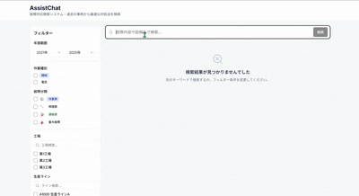

# AssistChat

**工場設備のトラブルシューティングを支援するRAG検索システム**


過去の保全記録（故障対応ログ）をハイブリッド検索し、類似事例を高精度で提示します。
現場でのダウンタイム短縮と、若手保全マンへの技能伝承を目的として開発しました。



---

## ✨ 特徴

- **ハイブリッド検索**: FAISS（ベクトル検索）+ BM25（キーワード検索）の組み合わせ
- **Re-ranking**: Cross-Encoderによる再順位付けで精度向上
- **階層フィルター**: 工場 → ライン → 設備の階層構造でドリルダウン
- **モノレポ構成**: フロントエンド、バックエンド、共通ライブラリを一元管理
- **品質保証**: MyPyによる型チェックとPytestによる自動テスト

---

## 🛠 技術スタック

| カテゴリ | 技術 |
|----------|------|
| **Frontend** | Next.js 14 (App Router), TypeScript, Tailwind CSS, shadcn/ui |
| **Backend** | FastAPI, Python 3.11 |
| **RAG Core** | Sentence-Transformers, FAISS, Rank-BM25, MeCab |
| **Re-ranker** | Cross-Encoder (mmarco-mMiniLMv2) |
| **Infrastructure** | Docker, Docker Compose |
| **CI/CD** | GitHub Actions (Lint, Type Check, Test) |

---

## 📂 プロジェクト構造

```
AssistChat/
├── apps/
│   └── assist-chat/        # Next.js Frontend
├── packages/
│   └── rag-core/           # 共通RAGライブラリ (Python)
├── services/
│   └── rag-api/            # FastAPI Backend
├── tools/
│   └── index-builder/      # インデックス構築ツール
├── data/
│   ├── demo/               # デモ用CSVデータ
│   └── indices/            # 検索インデックス
├── docs/                   # ドキュメント
└── docker-compose.yml
```

---

## 🚀 クイックスタート

### 前提条件

- Docker Desktop
- Git

### 1. リポジトリのクローン

```bash
git clone https://github.com/yourusername/AssistChat.git
cd AssistChat
```

### 2. アプリケーション起動

```bash
docker-compose up --build
```

起動後、以下のURLにアクセス:
- **Frontend**: http://localhost:3000
- **Backend API**: http://localhost:8001
- **API Docs**: http://localhost:8001/docs

### 3. インデックス構築（初回のみ）

別ターミナルで以下を実行:

```bash
# コンテナに入る
docker-compose exec rag-api bash

# インデックス構築
python /app/tools/index-builder/preprocess.py \
  --input /app/data/demo/demo_logs.csv \
  --output /app/data/processed

python /app/tools/index-builder/build_index.py \
  --input /app/data/processed/chunks.jsonl \
  --output /app/data/indices

exit
```

### 4. 動作確認

ブラウザで http://localhost:3000 を開き、検索ボックスに「コンベアが停止」などと入力して検索してみてください。

---

## 📖 ドキュメント

| ドキュメント | 内容 |
|-------------|------|
| [開発ストーリー](docs/DEVELOPMENT_STORY.md) | プロジェクトの背景、開発経緯、技術的チャレンジ |
| [アーキテクチャ](docs/ARCHITECTURE.md) | システム構成、検索フロー、API仕様 |
| [技術選定](docs/TECH_DECISIONS.md) | 各技術の選定理由と比較検討 |

---

## 🔍 検索の仕組み

```
ユーザークエリ
    │
    ├─→ [FAISS] ベクトル検索 (意味的類似性)
    │
    ├─→ [BM25] キーワード検索 (完全一致)
    │
    └─→ [RRF] 結果統合
            │
            ├─→ [Filter] メタデータフィルタリング
            │
            └─→ [Re-ranker] Cross-Encoderで再順位付け
                    │
                    ▼
              検索結果 (Top-K)
```

---

## 📊 デモデータについて

このリポジトリに含まれるデータは、実際の保全記録を参考に**統計的に生成したダミーデータ**です。
実在する設備の機密情報は一切含まれていません。

---

## 🧪 ローカル開発

### バックエンド単体起動

```bash
cd services/rag-api
pip install -r requirements.txt
pip install -e ../../packages/rag-core
python -m src.main
```

### フロントエンド単体起動

```bash
cd apps/assist-chat
npm install
npm run dev
```

### テスト実行

```bash
# ユニットテスト
pytest packages/rag-core/tests

# 型チェック
mypy packages/rag-core/rag_core services/rag-api/src
```

---

## 📝 今後の展望

- [ ] LLMによる回答生成（検索結果を元に自然言語で解決策を提案）
- [ ] フィードバック機能（ユーザー評価の収集と学習への活用）
- [ ] マルチモーダル対応（設備写真からの検索）

---

## 📄 ライセンス

MIT License

---

## 👤 作者

**Ryugo Hori**

- GitHub: [@RyugoHori](https://github.com/RyugoHori)
