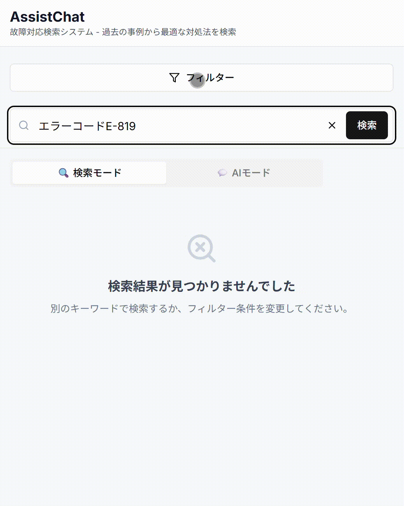

# AssistChat

[](https://github.com/RyugoHori/AssistChat-Portfolio/actions/workflows/ci.yml)

**工場設備のトラブルシューティングを支援するRAGベース検索システム**

過去の保全記録（故障対応ログ）をハイブリッド検索し、類似事例を高精度で提示。
現場でのダウンタイム短縮と、若手保全員への技能伝承を目的に開発。

---

## デモ

| PC版 | モバイル版 |
|------|-----------|
|  |  |

---

## 成果

- 類似事例の調査時間: 約30分 → 数秒
- Webアプリ化により現場での検索を実現
- 実業務展開: 保全員15名

### 精度評価（実データ約20,000件）

100 クエリ × 3 アノテータで関連判定を行い、2 名以上が relevant と判定した文書を正解としてラベリング。

| 検索手法 | MRR@5 | Recall@5 | 改善率 |
|---------|-------|----------|--------|
| Dense (ベクトル検索のみ) | 0.49 | 0.64 | Baseline |
| Sparse (キーワード検索のみ) | 0.46 | 0.65 | -6% |
| Hybrid (ベクトル + キーワード) | 0.65 | 0.78 | +33% |
| Hybrid + Re-ranker | **0.76** | **0.86** | **+55%** |

> ポートフォリオ環境（500件）では評価サンプル数が小さいため数値は参考値です。実運用では上記数値で本番稼働中。

---

## 特徴・技術的工夫

- **ハイブリッド検索**: pgvector（意味検索）+ BM25（キーワード検索）をRRFで統合し、専門用語・エラーコードの両方に対応
- **Re-ranking**: Cross-Encoderによる再順位付けで精度を大幅向上（MRR@5: +55%）
- **会話型 RAG（AI モード）**: Query Rewriting で多ターン会話の文脈を独立クエリに変換し、NDJSON で回答をトークン単位ストリーミング
- **幻覚対策**: 類似度スコアが閾値未満のときは LLM 回答生成を拒否し「低信頼度」ラベルを付与
- **データクレンジングパイプライン**: 表記揺れ・OCR エラー・重複・日付形式を正準化する前処理を [`tools/data_cleansing/`](tools/data_cleansing/README.md) に実装
- **フィードバックループ**: 役立ち度評価を JSONL で永続化し、将来のファインチューニング用データとして蓄積（[`tools/analyze_feedback.py`](tools/analyze_feedback.py)）
- **MLFlow 統合**: 評価メトリクス・パラメータ・レポートを MLFlow に記録して再現性を確保
- **検索機能は完全ローカル実行**（機密データを外部に送信しない設計）。AI モード利用時は社内 AI API に接続

> ※ ポートフォリオ環境ではOpenAI APIを使用。実運用環境では社内AI基盤（ChatAGC）のAPIを利用許可を得て使用。

---

## 技術スタック

| カテゴリ | 技術 |
|----------|------|
| Frontend | Next.js 14, TypeScript, Tailwind CSS, shadcn/ui |
| Backend | FastAPI, Python 3.11 |
| ベクトル検索 | PostgreSQL + pgvector |
| キーワード検索 | BM25 |
| Re-ranking | Cross-Encoder |
| LLM | OpenAI API (gpt-4o-mini) |
| 日本語処理 | MeCab + unidic-lite |
| インフラ | Docker Compose |
| CI/CD | GitHub Actions |

---

## クイックスタート

### 前提条件

- Docker Desktop
- OpenAI APIキー（AIモードを使用する場合）

### セットアップ

```bash
# 1. クローン
git clone https://github.com/RyugoHori/AssistChat-Portfolio.git
cd AssistChat-Portfolio

# 2. 環境変数設定（AIモードを使用する場合）
cp .env.example .env
# .env を開いて OPENAI_API_KEY を設定

# 3. 起動
docker-compose up --build

# 4. アクセス
# Frontend: http://localhost:3000
# API Docs: http://localhost:8001/docs
```

### インデックス構築（初回のみ）

```bash
docker-compose exec rag-api bash

# 前処理（CSV → チャンク分割）
python /app/tools/index-builder/preprocess.py \
  --input /app/data/demo/demo_logs.csv \
  --output /app/data/processed

# インデックス構築（PostgreSQL + BM25）
python /app/tools/index-builder/build_index.py \
  --input /app/data/processed/chunks.jsonl \
  --output /app/data/indices

exit
```

---

## ドキュメント

| ドキュメント | 内容 |
|-------------|------|
| [プロジェクトについて](docs/ABOUT_PROJECT.md) | 開発背景、技術選定の理由 |
| [アーキテクチャ](docs/ARCHITECTURE.md) | システム構成、検索フロー、API仕様 |

---

## プロジェクト構造

```
AssistChat/
├── apps/assist-chat/       # Next.js Frontend（Vitest テスト含む）
├── packages/rag-core/      # 共通RAGライブラリ（pytest + coverage）
├── services/rag-api/       # FastAPI Backend（ストリーミング対応）
├── tools/
│   ├── index-builder/      # インデックス構築ツール
│   ├── data_cleansing/     # 表記揺れ・OCR 補正・重複排除パイプライン
│   ├── evaluation/         # 検索精度 / RAG 品質評価（MLFlow 統合）
│   └── analyze_feedback.py # フィードバック集計
├── data/                   # デモデータ、インデックス、feedback.jsonl
└── .github/workflows/      # GitHub Actions（parallel jobs）
```

---

## データ品質向上（データクレンジング）

本番の保全記録は手書き OCR や現場別の表記ルールにより、そのままでは検索精度が伸びない。本リポジトリでは以下のパイプラインを [`tools/data_cleansing/`](tools/data_cleansing/README.md) に実装している:

1. **Unicode 正規化** (NFKC)：全角英数字・カタカナを半角に統一
2. **日付形式統一**: 和暦・西暦・区切り文字違いを ISO 8601 に正規化
3. **設備名の正準化**: `equipment_dictionary.yaml` に基づく alias → canonical 置換
4. **OCR エラー補正**: カタカナ語中に混入した漢字誤認識を文脈条件付きで補正
5. **品質フィルタ**: 文字数・エントロピー・言語判定で低品質レコードを除外
6. **重複排除**: 完全一致ハッシュ + Jaccard 近似重複（MinHash ライク）

ポートフォリオには匿名化した `dirty_sample.csv`（100 件）を同梱。本番では設備台帳と整合する 3,000 語規模の辞書を運用し、四半期ごとに辞書更新と精度評価を行う設計。

---

## 評価とモデル改善のループ

### 検索精度評価 (`tools/evaluation/`)

- `evaluate.py`: 検索手法（Dense / Sparse / Hybrid / Rerank）の MRR / Recall@K / Precision@K を計測
- `evaluator_rag.py`: **LLM-as-judge** による RAG 固有の評価（Faithfulness / Answer Relevancy / Context Precision）
- `evaluate_rag.py`: 上記を統合し **MLFlow** にパラメータ・メトリクス・アーティファクトを記録

```bash
# 検索精度のみ（CI で常時実行・LLM 不要）
python tools/evaluation/evaluate.py --simulate

# RAG 固有メトリクスを含むフル評価（手動実行・要 OpenAI API キー）
# MLflow UI: docker compose --profile mlops up -d mlflow  →  http://localhost:5001
MLFLOW_TRACKING_URI=http://localhost:5001 \
  python tools/evaluation/evaluate_rag.py --num-queries 10
```

### フィードバックループ

UI 上の「役に立った / 立たなかった」が `/api/feedback` に送信され、`data/feedback/feedback.jsonl` に追記される。`tools/analyze_feedback.py` で:

- 低評価ドキュメントの傾向分析
- LLM-as-judge の低スコア回答の集約
- 将来のファインチューニング用データセット生成

を行う。

---

## CI/CD

GitHub Actions で push / pull_request 時に以下を並列実行しています。

- **Backend**: Ruff (lint) / MyPy (typecheck) / Pytest + coverage / 検索評価 (simulate)
- **Frontend**: ESLint / `tsc --noEmit` / `next build` / Vitest
- **Docker**: バックエンド / フロントエンドの build 検証

補助的な設定:

- `concurrency` で同一 PR の古い実行を自動キャンセル
- ジョブごとに `timeout-minutes` を設定してハング対策
- Pre-commit hook（Ruff / gitleaks 等）で commit 時に軽いチェック（[`.pre-commit-config.yaml`](.pre-commit-config.yaml)）
- Dependabot で依存ライブラリを週次更新（[`.github/dependabot.yml`](.github/dependabot.yml)）

---

## 作者

**Ryugo Hori** - [@RyugoHori](https://github.com/RyugoHori)

21歳、製造業の設備保全担当。AGC株式会社にて機械保全とICT部門を兼務し、現在は8名チームでDatabricks版RAGシステムの開発を担当。

---

## ⚠️ 注意事項

AIモードを使用するにはOpenAI APIキーが必要です。APIキーなしでも検索機能は利用可能です。

```bash
cp .env.example .env
# .env を編集して OPENAI_API_KEY を設定
docker-compose restart rag-api
```
